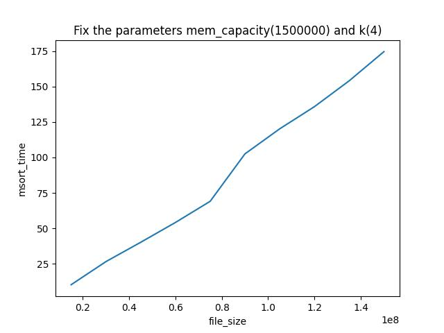
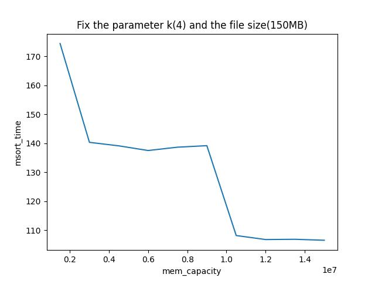
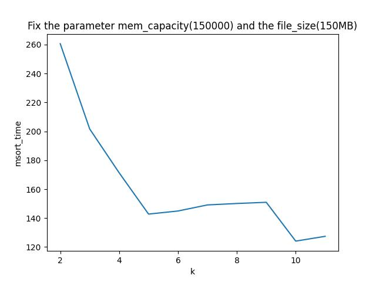
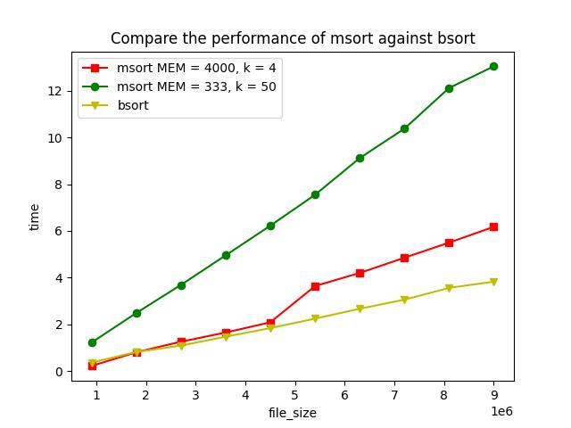

mergesort
=========

#### Measure the performance trend of msort with respect to different file sizes

#### Measure the performance trend of msort with respect to different total memory allowed

#### Measure the performance trend of msort with respect to different choices of k

#### Compare the performance of msort against bsort

## Install

Starter code for merge sort assignment

First you need to download and compile the [leveldb](https://github.com/google/leveldb) library:

	git clone --recurse-submodules https://github.com/google/leveldb.git
	cd leveldb
	mkdir -p build && cd build
	cmake -DCMAKE_BUILD_TYPE=Release .. && cmake --build .

Then you need to download and compile the [jsoncpp](https://github.com/open-source-parsers/jsoncpp) in order to read JSON file.

	# Go to another directory
	cd ..
	git clone https://github.com/open-source-parsers/jsoncpp.git
	cd jsoncpp
	# Generate amalgamated source and header
	python amalgamate.py

Now copy the generated source and headers to the mergesort directory:

	cd ../mergesort
	cp ../jsoncpp/dist/jsoncpp.cpp .
	cp -r ../jsoncpp/dist/json .

Then you can compile the starter code:

	make all

